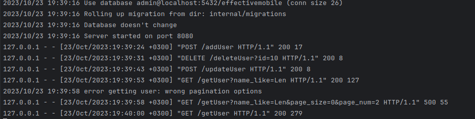
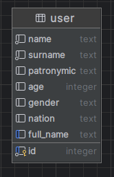
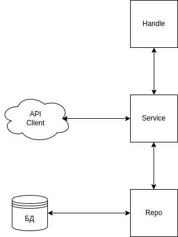

# Effective Mobile test task
## Запуск
```shell
make docker-up
```

Сервис запускается на адресе http://localhost:8085

**Swagger** документация доступна по адресу http://localhost:8085/swagger/index.html

## Makefile
В Make файле доступны следующие команды
- ```build``` - сборка сервиса
- ```gen-swagger``` - генерация Swagger документации
- ```docker-up``` - запуск контейнера
- ```test``` - запуск тестов

## Информация
- Есть механизм **миграций** БД
- Есть **Swagger** документация
- Есть интеграционные **тесты**
- Фильтры, настройки пагинации:
```
  Id       int    `query:"id" json:"id" example:"1"`
  NameLike string `query:"name_like" json:"name_like" example:"Pet"`
  AgeFrom  int    `query:"age_from" json:"age_from" example:"30"`
  AgeTo    int    `query:"age_to" json:"age_to" example:"90"`
  Gender   string `query:"gender" json:"gender" example:"male"`
  Nation   string `query:"nation" json:"nation" example:"RU"`
  PageSize int    `query:"page_size" json:"page_size" example:"2"`
  PageNum  int    `query:"page_num" json:"page_num" example:"1"`
```
- Для быстрого поиска пользователя по фрагменту ФИО есть служебный столбец full_name.
- Для оптимизации поиска по full_name есть индекс
- Взаимодействие со сторонним API **вынесено в отдельный клиент**
- При попытке удаление несуществующего id возвращается ошибка

## Endpoints
- /addUser [GET] - получения определенных пользователей(ля) при помощи фильтров. При отсутствии фильтров выводятся все пользователи
- /deleteUser [DELETE] - удаление пользователя id
- /updateUser [UPDATE] - обновление сущности пользователя по id


### Пример содержимого лога



## База данных
В качестве БД был выбран PostgreSQL

Сама БД состоит из таблицы user



## Архитектура
Архитектура сервиса реализована в соответствие с моделью гексагональной архитектуры

- Пакет **handle** - работа непосредственно с запросами к сервису
- Пакет **service** - бизнес-логика, не завязана на конкретную реализацию нижележащих модулей сервиса
- Пакет **repository** - логика взаимодействия с БД - запись/чтение
- API Client (**EnrichClient**) - клиент для взаимодействия с внешним API. Так же вынесен от основной бизнес-логики

